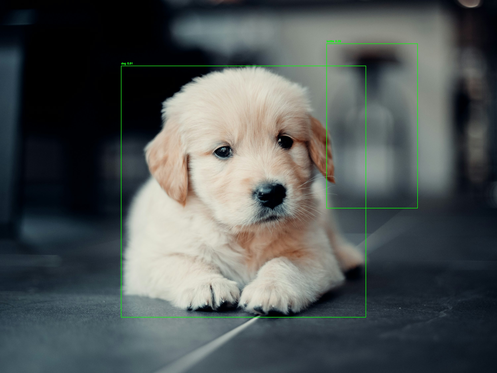

# Object Detection Microservice

This project implements a microservice for object detection using the ultralytics/yolov5 implementation. It consists of a UI backend service for handling user uploads and an AI backend service for performing object detection.

## Prerequisites

- Docker
- Docker Compose
- Git

## Setup

1. Clone this repository:
```bash
git clone https://github.com/iyappan04/object_detect.git
cd object_detect
```

2. Build and run the Docker containers:
```bash
sudo docker compose up --build
```

## Usage

1. Open a web browser and navigate to `http://localhost:8080`
2. Upload an image using the provided form
3. The system will process the image using YOLOv5 and return the detected objects
4. Results can be found in:
   - `outputs/`: Processed images with detection boxes and JSON files containing detection results.


## Project Structure

```
object_detect/
├── ui_backend/
│   ├── Dockerfile
│   ├── requirements.txt
│   ├── app.py
│   └── templates/
│       └── upload.html
├── ai_backend/
│   ├── Dockerfile
│   ├── requirements.txt
│   ├── app.py
├── outputs/
└── docker-compose.yml
```

## Detection Results

The system returns results in the following format:
```json
{
    "detections": [
        {
            "box": {
                "x1": 731,
                "x2": 2208,
                "y1": 397,
                "y2": 1913
            },
            "confidence": 0.91,
            "label": "dog"
        },
        {
            "box": {
                "x1": 1971,
                "x2": 2520,
                "y1": 263,
                "y2": 1255
            },
            "confidence": 0.29,
            "label": "bottle"
        }
    ],
    "image_path": "outputs/ec0e4800.jpg",
    "json_path": "outputs/ec0e4800.json",
    "message": "Detection completed"
}
```



## Check Output
```
http://ai_backend:5000/${image_path}
http://ai_backend:5000/${json_path}
```

### Example:
```
http://ai_backend:5000/outputs/ca7d05b3.json
http://ai_backend:5000/outputs/ca7d05b3.jpg
```